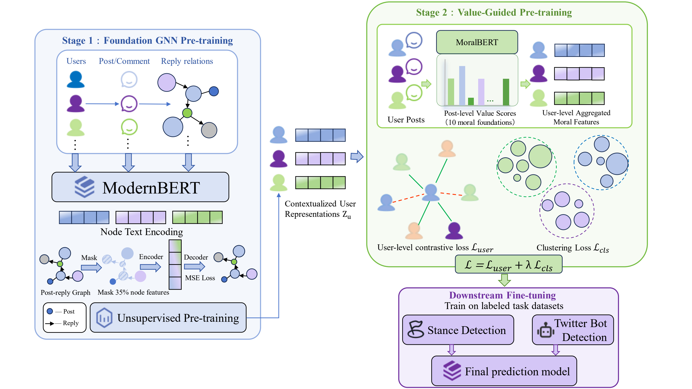

#  ValueGraph: Value-Signal Guided Graph Pre-training for Contextualized User Representation

<p align="center">
  <b>Yitong Han<sup>1</sup>, Wei Gao<sup>1</sup>, Yi Zhao<sup>1</sup>, Prasanta Bhattacharya<sup>2</sup>, Fengzhu Zeng<sup>1</sup>, Mohammad Amanlou<sup>1</sup></b>
</p>

<p align="center">
  <sup>1</sup>School of Computing and Information Systems, Singapore Management University, Singapore<br>
  <sup>2</sup>Institute of Advanced Intelligence and Computing, A*STAR, Singapore
</p>

 **ValueGraph** is a graph pre-training framework that uses automatically inferred moral-value signals as noisy auxiliary signals for contextualized user representation. From post-reply graphs, ValueGraph learns semantic and structural representations and further aligns users through relative value similarity with contrastive and clustering objectives. Rather than treating inferred values as gold psychological labels, ValueGraph uses them as soft constraints for representation learning. 

Experiments on stance detection and twitter bot detection show consistent gains over strong text-based, graph-based, and text-only LLM baselines, highlighting value-signal guidance as a useful inductive bias for socially informed user modeling.



## Requirements

Our pre-training and user-representation code is developed based on the
[GraphMAE2](https://github.com/THUDM/GraphMAE2) codebase. Node features are produced with
[ModernBERT](https://github.com/AnswerDotAI/ModernBERT).

Install the core dependencies:

```bash
pip install -r requirements.txt
```

Because DGL and `torch-scatter` must match your CUDA version, install them explicitly, e.g.:

```bash
conda install pytorch==2.4.1 torchvision==0.19.1 torchaudio==2.4.1 pytorch-cuda=12.4 -c pytorch -c nvidia
conda install dglteam/label/th24_cu124::dgl
conda install conda-forge::transformers
pip install torch-scatter==2.1.2 torch-geometric==2.6.1
```

The downstream baselines use additional third-party code: TwiBot-22,
MT-CSD, and the RumourEval 2019 baseline. See their own READMEs
under `downstreamtask/`.

## Data Preparation

Each social dataset (`twitter`, `reddit`) is stored as:

```
<data_dir>/<dataset>/
├── source.parquet   # post table (id, parent_id, text, split, ...)
└── feat.npy         # pre-computed node features (text embeddings)
```

1. Generate text features with ModernBERT:

   ```bash
   python gen_modernbert_embedding/genbymodernert.py
   ```

2. Place `feat.npy` and the corresponding `source.parquet` under `<data_dir>/<dataset>/`.

3. For Stage 2, prepare three JSON dictionaries: `user_map` (`{user_id: [post_ids]}`),
   `similar_users_dict`, and `dissimilar_users_dict`.

## Training & Evaluation

### Stage 1: pre-training

```bash
python GraphMae2/main_large.py \
  --dataset social --encoder gat --decoder gat \
  --config GraphMae2/configs/social.yaml \
  --data_dir /path/to/pretrain_data
```

### Stage 2: user representation

```bash
python GraphMae2/user_embedding.py
```

The script samples seed users, expands them with similar/dissimilar users, and trains with the
contrastive and clustering losses in `GraphMae2/losses.py`.

### Inference and fine-tuning

```bash
python GraphMae2/infer.py               # extract node embeddings
python GraphMae2/gen_userembedding.py   # batched embedding generation
python GraphMae2/main_finetune.py --dataset rumours_eval --pretrain_path <ckpt>
```

### Downstream tasks

```bash
# Bot detection (TwiBot-22)
python downstreamtask/botdetection/twibot_22/train.py
python downstreamtask/botdetection/GCN_GAT/train.py

# Stance detection
python downstreamtask/stancedetect/MT_CSD/train.py

# Significance testing
python p-value/train.py
```

## Citation

If you find this work useful, please consider citing:

```bibtex
@misc{han2026valuegraph,
  title        = {ValueGraph: Value-Signal Guided Graph Pre-training for Contextualized User Representation},
  author       = {Han, Yitong and Gao, Wei and Zhao, Yi and Bhattacharya, Prasanta and Zeng, Fengzhu and Amanlou, Mohammad},
  year         = {2026},
  eprint       = {2609.00057},
  archivePrefix = {arXiv},
  primaryClass = {cs.CL},
  url          = {https://arxiv.org/abs/2609.00057}
}
```

